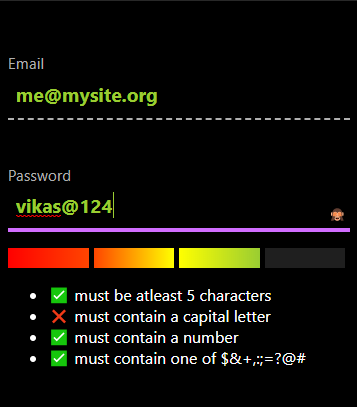

# Reactive Form Validations using Svelte
Simpe form validations done using Svelte.js
This idea is taken from fireship.io youtube tutorials.

## Screenshot


## Get started

Install the dependencies...

```bash
cd svelte-app
npm install
```

...then start [Rollup](https://rollupjs.org):

```bash
npm run dev
```

Navigate to [localhost:5000](http://localhost:5000)


## Building and running in production mode

To create an optimised version of the app:

```bash
npm run build
```